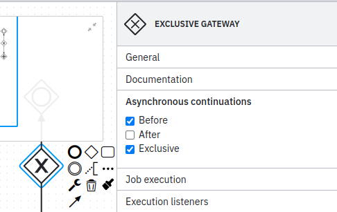
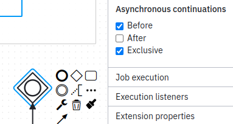
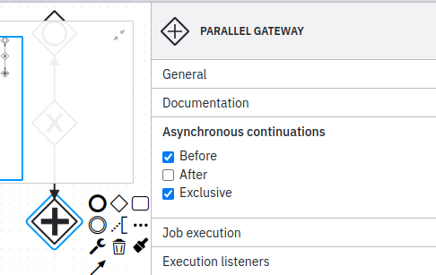
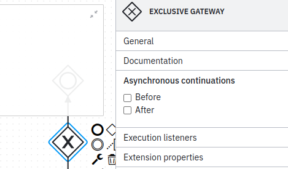
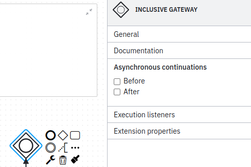
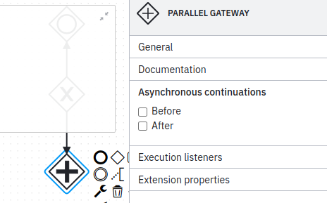

# No useless async (no-useless-async)

Don't configure save points before all forking and exclusively joining gateways.
There should just be no need to do that, unless execution listeners are
configured at such points, which could fail and might need to be transactionally
separated from other parts of the execution
See best
practice [Understanding Camunda 7 transaction handling](https://docs.camunda.io/docs/components/best-practices/development/understanding-transaction-handling-c7/#knowing-typical-dos-and-donts-for-save-points)

Example of **incorrect** usage for this rule:



```xml

<bpmn:exclusiveGateway id="Gateway_0t3vogs" camunda:asyncBefore="true">
</bpmn:exclusiveGateway>
```



```xml

<bpmn:inclusiveGateway id="Gateway_02dmbci" camunda:asyncBefore="true">
</bpmn:inclusiveGateway>
```



```xml

<bpmn:parallelGateway id="Gateway_1iescjs" camunda:asyncBefore="true">
</bpmn:parallelGateway>
```

Example of **correct** usage for this rule:



```xml

<bpmn:exclusiveGateway id="Gateway_0t3vogs">
</bpmn:exclusiveGateway>
```



```xml

<bpmn:inclusiveGateway id="Gateway_02dmbci">
</bpmn:inclusiveGateway>
```



```xml

<bpmn:parallelGateway id="Gateway_1iescjs">
</bpmn:parallelGateway>
```
